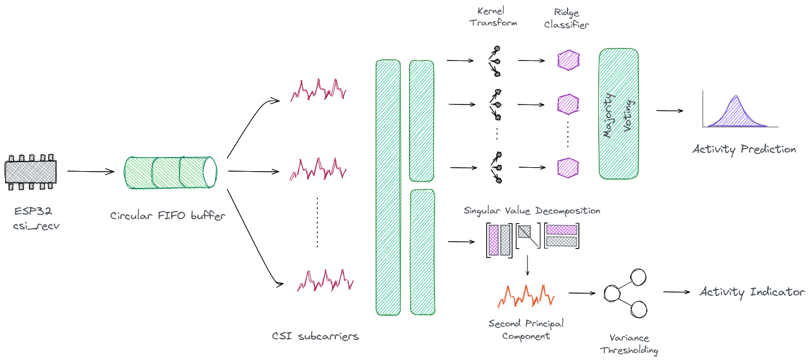

<div align="center">

# CSI Sense Zero

An attempt at a cost-effective and realtime human activity recognition solution capable of running on a Raspberry Pi Zero using Wi-Fi CSI data acquired from an ESP32 Wi-Fi module/devkit.

Approach based on ideas from [LiteHAR](https://arxiv.org/pdf/2201.09310.pdf) and [Rocket](https://arxiv.org/pdf/1910.13051.pdf).

</div>

---



---

## Getting Started

### Configuring ESPs

Two ESP32s - one for CSI broadcasting and the other for receiving is to be flashed with the [official ESP-CSI SDK](https://github.com/espressif/esp-csi). The exact version of the SDK used is available [here](./ESP32/).

Tested on: **ESP32-WROOM-32**

### Training Model Parameters

- Install runtime requirements

```bash
pip3 install -r requires/runtime.txt
```

- Download dataset

```bash
./tools/download_dataset.sh
```

For generating/training on a custom dataset, checkout the project [wiki](https://github.com/winwinashwin/CSI-Sense-Zero/wiki/Creating-and-Training-on-Custom-Dataset).
- Train parameters[^1]

```bash
python3 train.py --main-set ./dataset/rCSI-5.mat --hold-set ./dataset/rCSI-3.mat --train-size 0.8 --dump artifacts/v1
```

### Configuring the Pi

- Follow Pi specific setups [here](./RPi/README.md)

- Log CSI data to FIFO[^2]

> 

```bash
./tools/populate_csififo.sh -d /dev/ttyUSB0 -b 921600 -n /tmp/csififo -s 235 -p 0644 -u 1000
```

- Run HAR[^3]

```bash
python3 main.py --load artifacts/v1 --host 127.0.0.1 --port 9999 --frequency 2
```

[^1]: Training starts with a train-test split on the `main-set` as per `train-size`. The model is tested on the test split as well as a `hold-set`. The hold-set should ideally have CSI data captured on a different day and/or by different volunteers to see how well the model has generalised

[^2]: Creates a log file `/tmp/csififo` with 235k buffer size (holds ~256 CSI records) owned by user with UID == 1000 and file permissions 0644 . Reads serial device `/dev/ttyUSB0` at baud 921600 and populates `/tmp/csififo`

[^3]: Loads parameters from `artifacts/v1` and broadcasts predictions using a websocket server serving at 127.0.0.1:9999 at a frequency of 2 Hz
